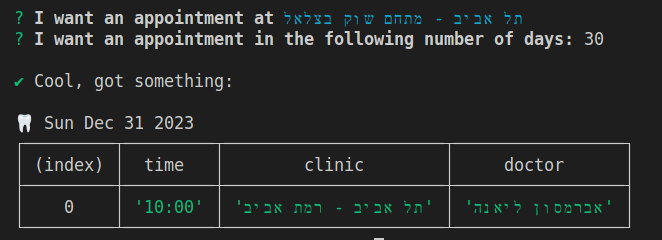

# Maccabi Toothy Tooth (shinnanit) 🦷

## Simple Run

To get the next available _"shinnanit"_ appointments, run:

```sh
npx maccabi-toothy-tooth
```

1. Select city:

    

2. Select the number of days and that's it!:

    

    _* Showing results from the surrounding areas._


## Script Run with Arguments

```
npx maccabi-toothy-tooth [-c <clinicId>] [-n <numOfDays>] [-rtl|--help]
```

* If `numOfDays` or `clinicId` are missing, then they will be prompted for
* For a full list of Clinic Ids see [This page](CLINICS.md)
* If you are using a terminal that does not support RTL then the text would be displayed in reveres. you can set `--rtl` to fix this issue.
