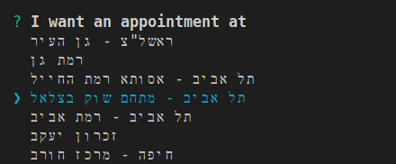

# Maccabi Toothy Tooth (shinnanit) 🦷
## Simple run
To get the next available _"shinnanit"_ appointments run:
```sh
npx maccabi-toothy-tooth
``` 


Select city:



Select the number of days and that's it!:


_* Showing results from the surrounding areas._

## Script run, with args

```sh
npx maccabi-toothy-tooth [-c <clinicId>] [-n <numOfDays>] [-h|--help] [--version]
```
_Missing args would be prompted for_

| Clinic ID | City                     |
| --------- | ------------------------- |
| 26        | אופקים                    |
| 13        | אילת                      |
| 19        | אשקלון                    |
| 14        | באר שבע - קריית הממשלה    |
| 54        | נתיבות                    |
| 24        | ערד                       |
| 32        | קריית גת                  |
| 36        | הוד השרון                 |
| 42        | הרצליה                    |
| 38        | חדרה                      |
| 7         | כפר סבא                   |
| 34        | נס ציונה                  |
| 31        | נתניה - עיר ימים          |
| 10        | רמת השרון                 |
| 23        | רעננה                     |
| 44        | בית שמש - מרכז נעימי      |
| 56        | ביתר עילית                |
| 11        | ירושלים - אגריפס          |
| 49        | ירושלים - פסגת זאב        |
| 41        | אור יהודה                 |
| 25        | בני ברק - רבי עקיבא       |
| 43        | בני ברק - כהנמן           |
| 8         | בת ים                     |
| 2         | גבעתיים                   |
| 15        | חולון - לנדאו             |
| 52        | מודיעין עילית             |
| 12        | פתח תקוה                  |
| 21        | קריית אונו                |
| 40        | ראש העין                  |
| 48        | ראשל"צ - מערב             |
| 20        | ראשל"צ - גן העיר          |
| 3         | רמת גן                    |
| 37        | תל אביב - אסותא רמת החייל |
| 1         | תל אביב - מתחם שוק בצלאל  |
| 35        | תל אביב - רמת אביב        |
| 53        | זכרון יעקב                |
| 9         | חיפה - מרכז חורב          |
| 29        | כרמיאל                    |
| 33        | נהריה                     |
| 45        | נוף הגליל                 |
| 4         | קריית אתא                 |
| 17        | קריית מוצקין              |
| 55        | אלעד                      |
| 18        | יבנה                      |
| 50        | מודיעין                   |
| 28        | רחובות                    |
| 22        | רמלה                      |
| 51        | שוהם                      |
| 57        | בית שמש ג'                |
| 6         | פרדס חנה כרכור            |
| 16        | חולון - קריית אילון       |
| 60        | באר שבע - גראנד קניון     |
| 58        | ירושלים - רמות אלון       |
| 63        | תל אביב - ויצמן           |
| 5         | נתניה - קריית השרון       |
| 61        | חיפה - הדר                |
| 30        | אשדוד                     |
| 62        | פתח תקוה - הדר גנים       |
| 64        | חריש                      |